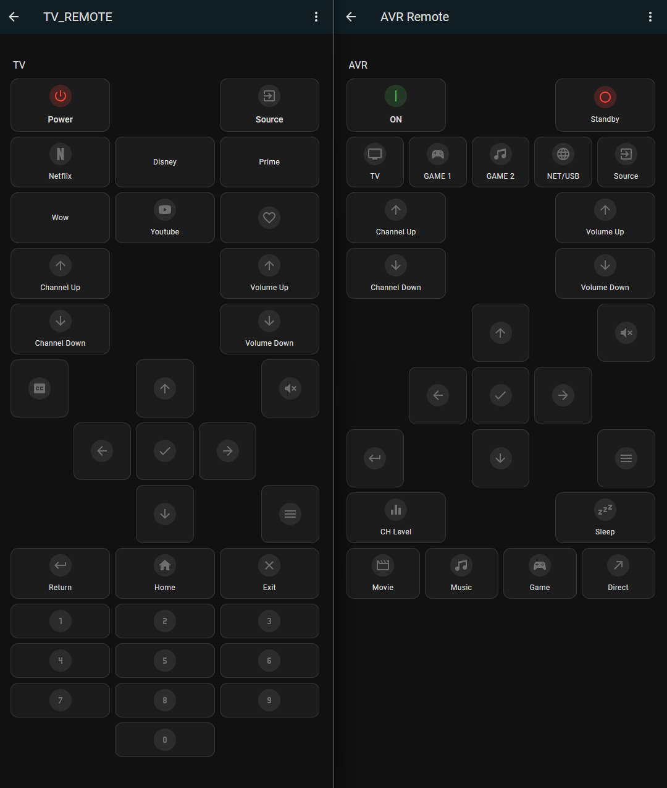

# HassBeam
A cheap and easy to use universal remote that can be integrated into Home Assistant using ESPHome.  
It allows you to replace your pile of different remote controls with one stationary device that can be controlled via Home Assistant. Of course, you can also automate the control of your IR devices.

  
  

## Requirements
To use this project, you will need a working [Home Assistant](https://www.home-assistant.io/) instance, as the universal remote integrates directly with it. The core of the device is an ESP32 micro controller, which communicates with Home Assistant via [ESPHome](https://esphome.io/).

In addition to the ESP32, a few electronic components are required — see the [Parts](hardware.md#parts) section for details. 

Optionally, design files for a custom PCB or perfboard layout are provided, along with a 3D-printable case for the device.

## Getting Started

To get started with the ESPHome Universal Remote, you will need to assemble the necessary hardware and flash the ESP32 with the appropriate configuration using ESPHome.

### Hardware Guide
The universal remote is fairly simple to build and use.  
Read the [Hardware Guide](hardware.md) for instructions on what you need and how to build it.

### Setup Guide

Once your hardware is ready, read the [Setup Guide](setup.md) to learn how to install and use the project.

 
 

---

 
 

## Related Projects

Check out these projects that helped in the creation of this project:
- [ESPHome](https://github.com/esphome/esphome)  
  Used to configure and flash the ESP32. Also handles IR signal sending and receiving.

- [Home Assistant](https://github.com/home-assistant/core)  
  Serves as the central control hub for triggering IR commands and integrating the remote into smart home automations.

- [Mushroom](https://github.com/piitaya/lovelace-mushroom)  
  A modern and customizable UI component library for Home Assistant dashboards, used in the example configuration to create clean remote interfaces.

- [Fritzing](https://github.com/fritzing/fritzing-app)  
  Used to create the wiring diagrams and PCB layout.
