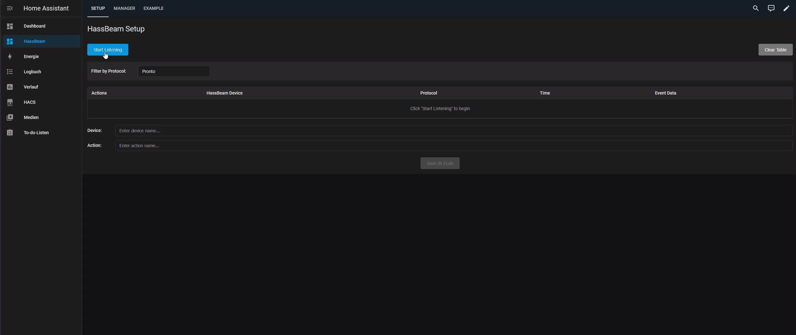
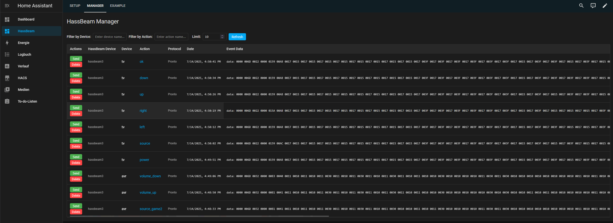
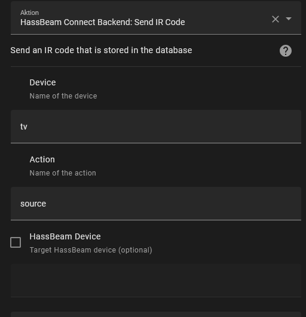

# HassBeam – Setup

## Contents

- [Installation](#installation)
- [Capturing IR Commands](#capturing-ir-commands)
- [Home Assistant Setup](#home-assistant-setup)
  - [Creating Scripts to Send IR Commands](#creating-scripts-to-send-ir-commands)
  - [Creating a Dashboard to Control Devices](#creating-a-dashboard-to-control-devices)

<br>
<br>

---

## Installation

Clone this repository or download the latest release.

To install the the software on your ESP32, first make sure to configure your Wi-Fi credentials.  
A sample configuration is provided in the [esphome folder](esphome). You just need to rename the file `secrets_template.yaml` to `secrets.yaml` and adjust it with your local SSID and password.  
After that you can flash the provided configuration file `hassbeam.yaml` using [ESPHome](https://esphome.io/).  

While ESPHome can be used directly within Home Assistant, **compilation on limited hardware can be extremely slow**. It's recommended to install and use the ESPHome CLI on a PC for faster builds and flashing. You can find installation instructions in the [ESPHome Getting Started guide](https://esphome.io/guides/getting_started_command_line.html).

#### ESPHome CLI (recommended)

- connect the device via USB (if wifi is already configured you can also use OTA instead of USB)
- open a terminal in the esphome folder
- run `esphome run .\hassbeam.yaml`
- select the proper device
- The code should now be compiled and flashed to the device

#### ESPHome Dashboard (not recommended for most cases)

- [Physically Connecting to your Device](https://esphome.io/guides/physical_device_connection#physically-connecting-to-your-device)
- [Device Builder](https://esphome.io/guides/getting_started_hassio#device-builder-interface)
- copy the code inside `hassbeam.yaml` and flash it to the device

<br>
<br>

---

## Home Assistant Setup

Once the ESP device is connected to your network, it should automatically be discovered by Home Assistant via ESPHome integration. If not, add it manually using its IP address (use the ESPHome integration).
<br>
<br>

---
## Capturing IR Commands
To make the setup process much faster and easier, you can use the HassBeam Connect Integration.
### Install HassBeam Connect
HassBeam Connect comes in two separate repos that contain the backend and frontend of the integration. You can install both manually but it is recommended to install them via [HACS](https://www.hacs.xyz/docs/use/download/download/)

- open HACS and click on the settings in the top right corner
- select custom repository
- add these two repositories:
  - Backend: `https://github.com/BasilBerg/hassbeam-connect-backend` Type: Integration 
  - Lovelace Cards: `https://github.com/BasilBerg/hassbeam-connect-cards` Type: Dashboard
- Search `HassBeam` in HACS and install `HassBeam Connect Backend` and `HassBeam Connect Cards`
- Go to Devices & Services and add the `HassBeam Connect Backend``Integration
- You can now add the `hassbeam-setup-card` and `hassbeam-manager-card` on any lovelace dashboard or use the [provided template dashboard](homeassistant/dashboard_hassbeam-connect_example.yaml)

### Using HassBeamConnect to capture commands
To capture IR commands you can use the `hassbeam-setup-card`.
- click Start Listening
- press the Button of the original remote
- the captured command(s) should now appear in the list
  - you can filter the list by protocol or leave this field empty to display all protocols
  - pronto is selected by default since it is not protocol specific and should work for all common devices
- Pick the command you want to save
  - if you're not sure which one will work, you can click send to replay the command and check if the device reacts as expected
  - click select on the command you want to save
- enter the name of the device this command controls
- enter the name of the action this command performs
- click Save IR Code




## Managing stored commands
To capture IR commands you can use the `hassbeam-manager-card`. This card can display a list of all commands you have saved. you can filter them by target device or action and you can replay the command from within this list. You can also delete commands.



## Sending IR Commands
You can use the saved IR codes on your dashboard or inside scripts, automations etc. using the `hassbeam_connect_backend.send_ir_code` service.  
This can either be done in the UI:



or in YAML:

```yaml
action: hassbeam_connect_backend.send_ir_code
data:
  device: tv    #Device name you specified during setup
  action: power #Action name you specified during setup
```


<br>
<br>

---


### Creating a Dashboard to Control Devices

You can create a user interface in Home Assistant to trigger these scripts easily. In the example setup, one dashboard page per remote is created (e.g., TV, AVR). The layout uses the [Mushroom](https://github.com/piitaya/lovelace-mushroom) custom cards from HACS for a clean and modern interface.

Example dashboard configurations are provided:

- [`dashboard_tv_example.yaml`](../homeassistant/dashboard_tv_example.yaml)
- [`dashboard_avr_example.yaml`](../homeassistant/dashboard_avr_example.yaml)

These can be imported or used as templates for your own setup.


---
